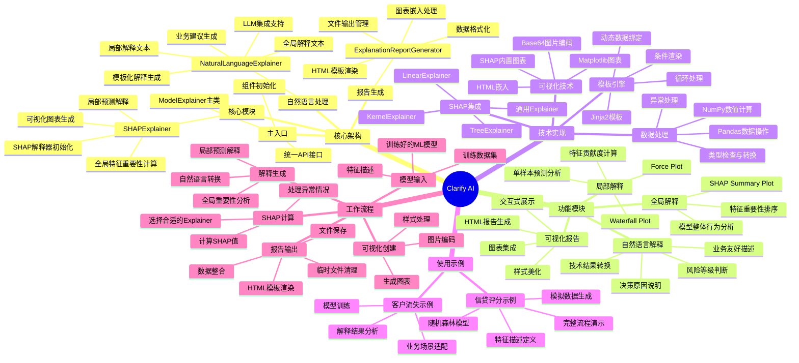
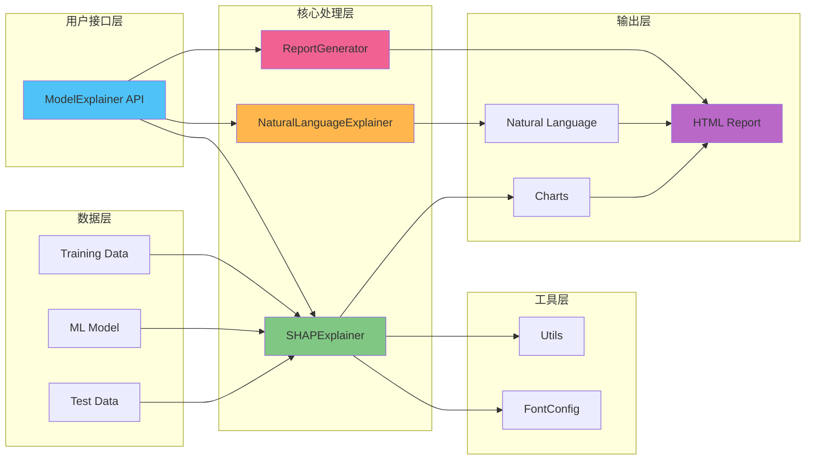

# Clarify AI 架构思维导图

## Mermaid 格式

```mermaid
mindmap
  root((Clarify AI))
    核心架构
      主入口
        ModelExplainer主类
        组件初始化
        统一API接口
      核心模块
        SHAPExplainer
          SHAP解释器初始化
          全局特征重要性计算
          局部预测解释
          可视化图表生成
      自然语言处理
        NaturalLanguageExplainer
          模板化解释生成
          LLM集成支持
          全局解释文本
          局部解释文本
          业务建议生成
      报告生成
        ExplanationReportGenerator
          HTML模板渲染
          图表嵌入处理
          数据格式化
          文件输出管理
    功能模块
      全局解释
        特征重要性排序
        SHAP Summary Plot
        模型整体行为分析
      局部解释
        单样本预测分析
        特征贡献度计算
        Waterfall Plot
        Force Plot
      自然语言解释
        技术结果转换
        业务友好描述
        风险等级判断
        决策原因说明
      可视化报告
        HTML报告生成
        图表集成
        样式美化
        交互式展示
    技术实现
      SHAP集成
        TreeExplainer
        LinearExplainer
        KernelExplainer
        通用Explainer
      可视化技术
        Matplotlib图表
        SHAP内置图表
        Base64图片编码
        HTML嵌入
      模板引擎
        Jinja2模板
        动态数据绑定
        条件渲染
        循环处理
      数据处理
        Pandas数据操作
        NumPy数值计算
        类型检查与转换
        异常处理
    使用示例
      信贷评分示例
        模拟数据生成
        随机森林模型
        特征描述定义
        完整流程演示
      客户流失示例
        业务场景适配
        模型训练
        解释结果分析
    工作流程
      模型输入
        训练好的ML模型
        训练数据集
        特征描述
      SHAP计算
        选择合适的Explainer
        计算SHAP值
        处理异常情况
      解释生成
        全局重要性分析
        局部预测解释
        自然语言转换
      可视化创建
        生成图表
        图片编码
        样式处理
      报告输出
        HTML模板渲染
        数据整合
        文件保存
        临时文件清理
```

## 流程图格式

```mermaid
graph TD
    A[Clarify AI] --> B[核心架构]
    A --> C[功能模块]
    A --> D[技术实现]
    A --> E[使用示例]
    A --> F[工作流程]
    
    B --> B1[主入口 clarify_ai.py]
    B --> B2[核心模块 src/core/]
    B --> B3[自然语言处理 src/nlp/]
    B --> B4[报告生成 src/report/]
    
    B1 --> B11[ModelExplainer主类]
    B1 --> B12[组件初始化]
    B1 --> B13[统一API接口]
    
    B2 --> B21[SHAPExplainer]
    B21 --> B211[SHAP解释器初始化]
    B21 --> B212[全局特征重要性计算]
    B21 --> B213[局部预测解释]
    B21 --> B214[可视化图表生成]
    
    B3 --> B31[NaturalLanguageExplainer]
    B31 --> B311[模板化解释生成]
    B31 --> B312[LLM集成支持]
    B31 --> B313[全局解释文本]
    B31 --> B314[局部解释文本]
    B31 --> B315[业务建议生成]
    
    B4 --> B41[ExplanationReportGenerator]
    B41 --> B411[HTML模板渲染]
    B41 --> B412[图表嵌入处理]
    B41 --> B413[数据格式化]
    B41 --> B414[文件输出管理]
    
    C --> C1[全局解释]
    C --> C2[局部解释]
    C --> C3[自然语言解释]
    C --> C4[可视化报告]
    
    C1 --> C11[特征重要性排序]
    C1 --> C12[SHAP Summary Plot]
    C1 --> C13[模型整体行为分析]
    
    C2 --> C21[单样本预测分析]
    C2 --> C22[特征贡献度计算]
    C2 --> C23[Waterfall Plot]
    C2 --> C24[Force Plot]
    
    C3 --> C31[技术结果转换]
    C3 --> C32[业务友好描述]
    C3 --> C33[风险等级判断]
    C3 --> C34[决策原因说明]
    
    C4 --> C41[HTML报告生成]
    C4 --> C42[图表集成]
    C4 --> C43[样式美化]
    C4 --> C44[交互式展示]
    
    D --> D1[SHAP集成]
    D --> D2[可视化技术]
    D --> D3[模板引擎]
    D --> D4[数据处理]
    
    D1 --> D11[TreeExplainer]
    D1 --> D12[LinearExplainer]
    D1 --> D13[KernelExplainer]
    D1 --> D14[通用Explainer]
    
    D2 --> D21[Matplotlib图表]
    D2 --> D22[SHAP内置图表]
    D2 --> D23[Base64图片编码]
    D2 --> D24[HTML嵌入]
    
    D3 --> D31[Jinja2模板]
    D3 --> D32[动态数据绑定]
    D3 --> D33[条件渲染]
    D3 --> D34[循环处理]
    
    D4 --> D41[Pandas数据操作]
    D4 --> D42[NumPy数值计算]
    D4 --> D43[类型检查与转换]
    D4 --> D44[异常处理]
    
    E --> E1[信贷评分示例]
    E --> E2[客户流失示例]
    
    E1 --> E11[模拟数据生成]
    E1 --> E12[随机森林模型]
    E1 --> E13[特征描述定义]
    E1 --> E14[完整流程演示]
    
    E2 --> E21[业务场景适配]
    E2 --> E22[模型训练]
    E2 --> E23[解释结果分析]
    
    F --> F1[模型输入]
    F --> F2[SHAP计算]
    F --> F3[解释生成]
    F --> F4[可视化创建]
    F --> F5[报告输出]
    
    F1 --> F11[训练好的ML模型]
    F1 --> F12[训练数据集]
    F1 --> F13[特征描述]
    
    F2 --> F21[选择合适的Explainer]
    F2 --> F22[计算SHAP值]
    F2 --> F23[处理异常情况]
    
    F3 --> F31[全局重要性分析]
    F3 --> F32[局部预测解释]
    F3 --> F33[自然语言转换]
    
    F4 --> F41[生成图表]
    F4 --> F42[图片编码]
    F4 --> F43[样式处理]
    
    F5 --> F51[HTML模板渲染]
    F5 --> F52[数据整合]
    F5 --> F53[文件保存]
    F5 --> F54[临时文件清理]
    
    style A fill:#e1f5fe
    style B fill:#f3e5f5
    style C fill:#e8f5e8
    style D fill:#fff3e0
    style E fill:#fce4ec
    style F fill:#f1f8e9
```

## 组件关系图

```mermaid
graph LR
    subgraph "用户接口层"
        UI[ModelExplainer API]
    end
    
    subgraph "核心处理层"
        SHAP[SHAPExplainer]
        NLP[NaturalLanguageExplainer]
        REPORT[ReportGenerator]
    end
    
    subgraph "工具层"
        FONT[FontConfig]
        UTILS[Utils]
    end
    
    subgraph "数据层"
        DATA[Training Data]
        MODEL[ML Model]
        TEST[Test Data]
    end
    
    subgraph "输出层"
        HTML[HTML Report]
        CHARTS[Charts]
        TEXT[Natural Language]
    end
    
    UI --> SHAP
    UI --> NLP
    UI --> REPORT
    
    SHAP --> FONT
    SHAP --> UTILS
    
    DATA --> SHAP
    MODEL --> SHAP
    TEST --> SHAP
    
    SHAP --> CHARTS
    NLP --> TEXT
    REPORT --> HTML
    
    CHARTS --> HTML
    TEXT --> HTML
    
    style UI fill:#4fc3f7
    style SHAP fill:#81c784
    style NLP fill:#ffb74d
    style REPORT fill:#f06292
    style HTML fill:#ba68c8
```